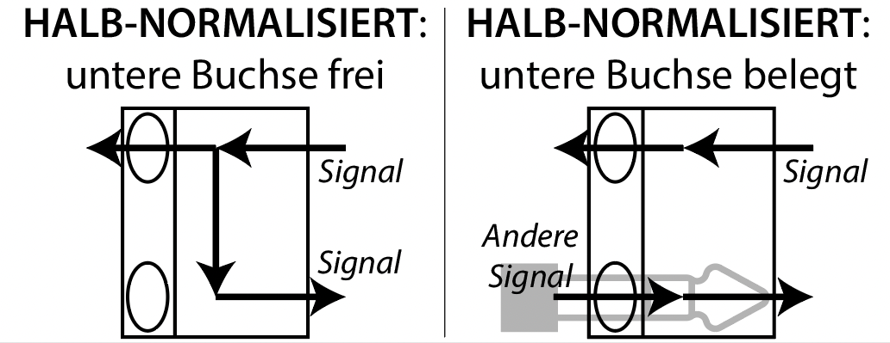

# Studio 1 Anleitung

Studio 1 verfügt über ein äußerst leistungsfähiges, wenn auch etwas komplexes Setup, insbesondere wenn außergewöhnliche Projekte realisiert werden sollen. Die Hauptausrichtung liegt auf der Produktion und dem Mischen von Mehrkanal-Produktionen mit eigenen Rechnern, basierend auf der DANTE Audio-over-IP-Netzwerktechnologie. Allerdings eignet sich das Studio auch hervorragend für Aufnahmen oder Stereoproduktionen.

Zu den Ausstattungsmerkmalen gehören hochwertige Lautsprecher, ein erstklassiger AD/DA-DANTE-Wandler, und ein Flaggschiff-8-Kanal-Mikrofonvorverstärker und (Dante-) Wandler. Darüber hinaus steht eine hochqualitative analoge 16-Kanal-Mikrofonvorverstärkeranlage zur Verfügung.

Für weniger aufwendige Stereo- oder Quad-Setups besteht die Möglichkeit, das FIREFACE UC (oder Miniklinke/DI) und das Mackie-Pult zu verwenden, ohne auf das DANTE-Netz zurückgreifen zu müssen. Ähnlich wie in der Vergangenheit. Dabei ersetzt das Mackie-Pult das frühere Abhörsystem.

# Treiber und Links

### RME - DIGIFACE DANTE
- https://rme-audio.de/driverkit-vs-kernel-extension.html (INFO)
- https://rme-audio.de/downloads.html

RME bietet verschiedene Treiberarten für Apple-Rechner an. Weitere Informationen findet man im oben stehenden Link. In den nächsten Jahren wird sich dies voraussichtlich ändern.

Zusätzlich gibt es optionale Treiber, um das Digiface auch als Netzwerkswitch zu verwenden, anstatt einen zusätzlichen Netzwerkanschluss für die Steuerung des Dante-Netzwerks zu benötigen (RME Network Interface für Digiface AVB und Digiface Dante).

Ältere USB-Treiber von RME könnten möglicherweise mit dem Digiface funktionieren. Es wird jedoch empfohlen, ein Update auf die neueste Version durchzuführen.

### AUDINATE DANTE
- https://my.audinate.com/support/downloads/dante-controller (benötigt eine kostenlose Konto bei Audinate)

### FOCUSRITE REDNET MP8R
- https://downloads.focusrite.com/focusrite-pro/rednet/rednet-mp8r

# Geräte und Anschlüsse am Arbeitsplatz

- RTW TC5 Monitor Controller - Verbunden mit dem DANTE Netzwerk (mit Strom über PoE)
- RME Digiface DANTE - USB Anschlusskabel 
- ElGato TB2 Dock - MacStudio Serverraum
- Kensington TB3/USB-C Dock - Eigene TB3 Apple Rechner (Strom, Maus, Tastatur, Video und DANTE-Netzwerk)
- KVM Switch (Keyboard, Video, Mouse) - Bild, Maus und Tastatur Auswahl zwischen:
	- PC1: MacStudio Serverraum
	- PC2: Kensington TB3/USB-C Dock (Apple Rechner)
	- PC3: Einzelne USB und HDMI Anschlüsse (WIN Rechner)
- Netzwerk Switch ins DANTE-Netzwerk (Nicht mit ICEM Netzwerk oder Internet verbunden)
- Netzwerkkabel ins DANTE-Netzwerk für WIN Rechner.
- Maus/Tastatur angeschlossen an den KVM Switch
- Bildschirm angeschlossen an den KVM Switch

# Setup

## ANALOG (schwarze Pfeile im Diagramm)

### Patchbay 

Alle analogen Leitungen verlaufen über die Neutrik TT-Steckfelder im Rack und sind für die häufigsten Anwendungsfälle ohne zusätzliches Verkabeln vorbereitet, dank der Normalisierung der Steckfelder. Normalisierung bedeutet in diesem Kontext, dass Signale weitergeleitet werden, als ob ein Kabel eingesteckt wäre. Spezifisch sind die Steckfelder halb-normalisiert nach unten, d. h., von der oberen Buchse zur unteren Buchse. Alle Buchsen mit Beschriftung auf weißem Hintergrund sind halb-normalisiert. Die Verbindung wird unterbrochen, wenn ein Kabel in die untere Buchse eingesteckt wird. Im Gegensatz dazu unterbricht das Einstecken oben die Verbindung nicht, sondern wirkt wie ein Splitter: Das Signal setzt seinen Weg nach unten fort und fließt gleichzeitig durch das eingesteckte Kabel.

### Mackie Mischpult, Lautsprecher 1-4 und LR

Die Verbindungen zu den Lautsprechern L und R an der Wand sowie zu den Lautsprechern 1-4 erfolgen über das Mackie 1642 VLZ4 Mischpult am Fenster. Die Lautsprecher LR sind an den MAIN OUT des Pultes angeschlossen, während die Lautsprecher 1-4 an die BUSSE 1-4 angeschlossen sind. Alles ist über die Neutrik-Steckfelder normalisiert (siehe oben).
Die Inputs des Mackie-Pults sind wie folgt belegt:

- Kanäle 1-4: DANTE Kanäle 1-4 von ANDIAMO Out 1-4
- Kanäle 5-8: RME Fireface UC Out 1-4
- Kanäle 9-10 (Stereo): RME Fireface UC Out 5-6
- Kanäle 11-12 (Stereo): DI-Box
- Kanäle 13-14 (Stereo): CD Player
- Kanäle 15-16 (Stereo): Apollo Mon Out

Das Routing wird über das Pult mittels Knöpfe und Panorama-Einstellungen gesteuert. Um die 4 großen Genelec1038 Lautsprecher (QUAD) gleich laut zu haben wie die restliche kleine Genelec 8040 Lautsprecher (DOME), müssen die erste 4 Kanäle (DANTE) im Mackie Pult wie folgt eingestellt werden:

- Input Gain: ganz nach links (-20dB bzw U)
- PAN: 1 L, 2 R, 3 L, 4 R
- EQ: Alles auf 0
- Routing: Kanal 1 und 2 auf Bus 1-2, Kanal 3 und 4 auf Bus 3-4
- Level: Fader der Kanäle 1-4 und Fader der Ausgänge auf Maximum (+10dB)

### Mikrofrone, Vorverstärker, Wandler

Alle Mikrofoneingänge des Focusrite REDNET MP8R und des AUDIO216-Vorverstärkermoduls ('PREAMPS') stehen über die Neutrik-Steckfelder zur Verfügung, Mikrofone werden über die 3 XLR ‘Breakout’-Panels angeschlossen. Diese Anschlüsse sind NICHT normalisiert und müssen manuell gepatcht werden. 

Beispiel: Ein Mikrofon (XLR-Kabel) wird in XLR Breakout 1, Buchse 1 gesteckt. Im Steckfeld wird dann XLR 1,1 auf PREAMPS In 1 gepatcht. Die Vorverstärker werden eingestellt, und das Signal geht über die Normalisierung direkt auf Input 1 des ANDIAMO.

Andere LINE-Analogsignale können direkt über das XLR-Breakout und die Steckfelder (oder mittels TT-Adapterkabel) direkt auf das ANDIAMO geschickt werden, um dort digitalisiert und ins DANTE-Netzwerk übertragen zu werden.

## DIGITAL/DANTE (blaue Pfeile im Diagramm)

Studio 1 ist für verschiedene Abhör-Szenarien konzipiert:

- Mono bis 20.1 Mehrkanal (DANTE) über Digiface mit eigenem Rechner oder MacStudio
- Mono bis 20.1 Mehrkanal (DANTE) über Dante Virtual Soundcard mit eigenem Rechner, MacStudio (Serverraum) oder AstroSpatial Rechner (Serverraum), oder ein anderes externes Gerät (z. B. LINUX Rechner über das Soundcraft Pult).
- Arbeiten mit eigenen Rechnern am großen Tisch am Fenster (RME FIREFACE UC oder Miniklinke).

*WICHTIG:* Die Dante Virtual Soundcard (DVS) und das Digiface Dante von RME erfüllen dieselbe Funktion. Die Verwendung des Digiface anstelle von DVS bietet zahlreiche Vorteile und entlastet den Computer erheblich. Es sollte entweder das eine oder das andere verwendet werden und nicht beide gleichzeitig. Anders ausgedrückt: Wenn das Digiface genutzt werden soll, ist das Starten von DVS nicht erforderlich (oder empfohlen).

### RME DigifaceDANTE und TotalMix

Zentral für das Arbeiten am Arbeitsplatz ist das RME DigifaceDANTE USB Interface am Tisch, das über USB3 angeschlossen wird (ein Kabel mit USB-A und USB-C Anschlüssen liegt am Tisch). Es fungiert als Schnittstelle zwischen den eigenen Rechnern und dem DANTE Netzwerk. Weitere Informationen findet man [hier](https://rme-audio.de/de_digiface-usb.html).

Das Routing im DIGIFACE wird durch die Software TotalMix gesteuert. Das Standard-Preset, oder WORKSPACE benannt kann [hier](https://github.com/Folkwang-ICEM/reaper/tree/main/Studio-1-Vorlagen-TotalMix-Dante) gefunden werden, und weitere Informationen zu TotalMix sind [hier](https://rme-audio.de/de_totalmix-fx.html) verfügbar.

**Das Routing im TotalMix ist standardmäßig wie folgt:**

Ins PHONES BUS gehen alle SOFTWARE PLAYBACK Kanäle. Andernfalls werden die Software Playback-Kanäle einzeln in die entsprechenden Busse geleitet:
- SOFTWARE PLAYBACK 1—> HARDWARE OUTPUT 1
- SOFTWARE PLAYBACK 2 —> HARDWARE OUTPUT 2
- SOFTWARE PLAYBACK 3 —> HARDWARE OUTPUT 4
- ... Usw.

Zusätzlich werden die Eingänge 41 bis 64 in die Ausgänge 1 bis 24 geleitet, um externe Geräte (wie das Soundcraft Pult für LINUX Nutzer) oder DVS-Rechner (wie den MacStudio oder Astrospatial im Serverraum) anzuschließen.

HARDWARE INPUT 41 —> HARDWARE OUTPUT 1
HARDWARE INPUT 42 —> HARDWARE OUTPUT 2

Die Inputs 1 bis 40 gehen standardmäßig NICHT in die PHONES oder andere OUTPUT BUSSE, um die Gefahr von Rückkopplungen zu vermeiden.
Die Workspace Datei enthält außerdem verschiedene SNAPSHOTS:
S1 Reset: stellt alles ein wie oben beschrieben
S1 Reset St: Wie S1 Reset aber mit Stereo Kanäle
S1 no Ext: Wie S1 Reset ohne die Sends von Inputs 41 bis 64 in die Outputs 1 bis 24.
S1 Backup: Ein Backup von S1 Reset falls man es aus Versehen überschreibt.

### Wandler
Die Wandlung zwischen dem DANTE Netzwerk und der analogen Welt erfolgt über das ANDIAMO von Direct Out und/oder das RedNet MP8R von Focusrite. Beide Geräte befinden sich im Rack und sind bereits in das DANTE Netzwerk integriert.
- Das ANDIAMO ist ein 32-Kanal-Line-AD/DA-Wandler (Analog-zu-Digital/Digital-zu-Analog). Weitere Informationen findet man [hier](https://www.directout.eu/de/product/andiamo/).
- Das REDNET MP8R ist ein 8-Kanal-Mikrofonvorverstärker und AD-Wandler. Weitere Informationen findet man [hier](https://focusrite.com/products/rednet-mp8r). 

### Dante Controller

Die digitalen Signale aus den Wandlern werden mittels des Dante Controller auf das DigifaceDANTE geroutet. Das Preset für den Dante Controller kann [hier](https://github.com/Folkwang-ICEM/reaper/tree/main/Studio-1-Vorlagen-TotalMix-Dante) heruntergeladen werden. Das Laden des Presets im Dante Controller setzt alles zurück auf das Standard-Setup, falls etwas verstellt wurde.

**Das Routing im Dante Controller ist Standardmäßig wie folgt:** 

- ANDIAMO TRANSMITTER (OUT) 1 - 32 —> DIGIFACE RECEIVER (IN) 1 - 32
- REDNET MP8R TRANSMITTER (OUT) 1 - 8 —> DIGIFACE RECEIVER (IN) 33 - 40
-
- ANDIAMO TRANSMITTER (OUT) 1 - 32 —> MACSTUDIO (DVS) RECEIVER (IN) 1 - 24
- REDNET MP8R TRANSMITTER (OUT) 1 - 8 —> MACSTUDIO (DVS) RECEIVER (IN) 25 - 32
-
- MACSTUDIO (DVS) TRANSMITTER (OUT) 1 -24 —> DIGIFACE RECEIVER (IN) 41 - 64
-
- DIGIFACE TRANSMITTER (OUT) 1 - 24 —> RTW TC5 RECEIVER (IN) 1 - 24
- DIGIFACE TRANSMITTER (OUT) 25 - 33 —> ANDIAMO RECEIVER (IN) 25 - 33
-
- RTW TC5 TRANSMITTER (OUT) 1 - 24 —> ANDIAMO RECEIVER (IN) 1 - 24

**Dieses Routing sollte nicht verändert, oder nach jeder Änderung für den nächsten Nutzer zurückgesetzt werden!**

### RTW TouchControl 5

Der RTW TouchControl 5 (TC5) steuert die Lautstärke, das Monitoring und das Bassmanagement für alle Lautsprecher im DOME (20.1). Um die Lautstärke der Lautsprecher 1-4 an alle anderen anzupassen, muss das MACKIE PULT (am Fenster) wie [hier](#mackie-mischpult-lautsprecher-1-4-und-lr) beschrieben eingerichtet werden. Weitere Informationen zum TC5 findet man [hier](https://www.rtw.com/de/produkte-gelistet/audio-monitore/touchcontrol-5.html) und zum Lautsprecher-Setup [hier](#lautsprecher-setup).

# Routings für die meisten Anwendungsfälle

## Einen Studio-PC oder den eigenen Rechner anschließen

### Mono bis 20.1 Mehrkanal (DANTE) über Digiface mit eigenem Rechner oder MacStudio

Benötigte Software/Treiber: Die erforderliche Software und Treiber umfassen RME Treiber und Software, REDNET Steuerungssoftware sowie den Dante Controller.

An den eigenen Rechner muss folgendes angeschlossen werden: 

**Für Apple Rechner mit Thunderbolt 3 oder neuer:**
- DigifaceDANTE (USB-C Kabel mit weißer Beschriftung, kann direkt in den grün markierten KVM Switch gesteckt werden)
- TB3 Dock (Thunderbolt/USB-C Kabel mit roter Beschriftung) für Strom, Dante Netzwerk, und KVM Switch. **KVM Switch auf PC1 setzten**

**Windows Rechner oder ältere Apple Rechner:**
- DigifaceDANTE (USB-C Kabel mit weißer Beschriftung, kann direkt in den grün markierten KVM Switch gesteckt werden)
- USB, HDMI (Alle Kabel mit grüner Beschriftung) die mit den KVM Switch verbunden sind. **KVM Switch auf PC2 setzen.**
- Netzwerk (Adapter auf USB-C liegt dabei, Kabel mit grüner Beschriftung)
- Strom, wenn gewünscht.

**Linux Rechner**
Das Soundcraft Pult ist aktuell das einzige DANTE fähige Gerät, das class compliant ist. Ein Linux Rechner kann an das Pult angeschlossen werden. Dieses muss dann über den Dante Controller entsprechend geroutet werden.

**MacStudio (Serverraum)**
- DigifaceDANTE (USB-C Kabel mit weißer Beschriftung, kann direkt in den grün markierten KVM Switch gesteckt werden)
- KVM Switch auf PC3 setzen

## Tafel Stereo
### mobiler Arbeitsplatz

- Laptop wie [hier](#mono-bis-201-mehrkanal-dante-über-digiface-mit-eigenem-rechner-oder-macstudio) beschrieben anschließen.
- Audio auf die ersten zwei Kanäle (Dante 1+2) des Digiface schicken.
- Am [Mischpult](#mackie-mischpult-lautsprecher-1-4-und-lr) die ersten zwei Kanäle über die Knöpfe und Panorama auf LR schicken. Über die Fader und "Main Mix", sowie den RTW TouchControl die Lautstärke regeln.
- Der RTW TouchControl muss auf das 20.1 Preset gestellt sein (unten rechts auswählbar).

### Arbeitsplatz großer Tisch
- RME Fireface am Tiscch über USB Kabel anschließen (benötigt RME Treiber). Ein Doppelklick auf den Drehknopf schaltet das Interface zwischen Mac und Windows um (dabei darf das Gerät nicht angeschlossen sein).
- Audio auf die ersten zwei Kanäle (AN 1+2) schicken.
- Am [Mischpult](#mackie-mischpult-lautsprecher-1-4-und-lr) die entsprechenden mit "RME FIREFACE" markierten Kanäle über die Knöpfe und Panorama auf LR schicken. Über die Fader und "Main Mix" die Lautstärke regeln.

## Lautsprecher 1-4
### mobiler Arbeitsplatz
- Rechner wie [hier](#mono-bis-201-mehrkanal-dante-über-digiface-mit-eigenem-rechner-oder-macstudio) beschrieben anschließen.
- Audio auf die ersten vier Kanäle (Dante 1-4) des Digiface schicken.
- Am [Mischpult](#mackie-mischpult-lautsprecher-1-4-und-lr) die ersten vier Kanäle über die Knöpfe und Panorama Regler auf 1-2, bzw. 3-4 schicken. Über die Fader und "Main Mix", sowie den RTW TouchControl die Lautstärke regeln.
- Der RTW TouchControl muss auf das 20.1 Preset gestellt sein (unten rechts auswählbar).

### Arbeitsplatz großer Tisch
- RME Fireface am Tiscch über USB Kabel anschließen (benötigt RME Treiber). Ein Doppelklick auf den Drehknopf schaltet das Interface zwischen Mac und Windows um (dabei darf das Gerät nicht angeschlossen sein).
- Audio auf die ersten vier Kanäle (AN 1-4) schicken.
- Am [Mischpult](#mackie-mischpult-lautsprecher-1-4-und-lr) die entsprechenden mit "RME FIREFACE" markierten Kanäle über die Knöpfe und Panorama Regler auf 1-2, bzw. 3-4 schicken. Über die Fader und "LS 1-4" die Lautstärke regeln.

## DOME
### mobiler Arbeitsplatz
- Rechner wie [hier](#mono-bis-201-mehrkanal-dante-über-digiface-mit-eigenem-rechner-oder-macstudio) beschrieben anschließen.
- Audio auf die gewünschten Kanäle (Dante 1-21) des Digiface schicken.
- Welchen Lautsprechern diese Kanäle entsprechen, hängt vom Preset im RTW TouchControl ab. Das 20.1 Preset (unten rechts auswählbar) entspricht der [ICEM-Norm](#lautsprecher-setup).
- Das [Mischpult](#mackie-mischpult-lautsprecher-1-4-und-lr) muss wie [oben](#mackie-mischpult-lautsprecher-1-4-und-lr) beschrieben eingestellt sein, damit Lautsprecher 1-4 gleich laut sind wie 5-20.
- Über den RTW TouchControl kann die Lautstärke geregelt werden.

## Aufnahme
### mobiler Arbeitsplatz
- mikro - breakout - preamp - automatisch auf andiamo 1-8 -> digiface In 1-8
### Arbeitsplatz großer Tisch
- mikro - breakout - preamp - an der patchbay Preamp Out ind RME In stecken.

# Lautsprecher Setup

Die Lautsprecherkonstellation bleibt erstmal nach der inoffizielle ICEM-Norm bestimmt: Lautsprecher werden nach Ringen oder Ebenen im Uhrzeigersinn anfangend vorne links nummeriert. 
- Lautsprecher 1-4: Quadrofonischen Setup, große Genelecs 1038.
- Lautsprecher 5-8: Genelec 8040 zwischen Positionen 1-4. 5 ist Center vorne
- Lautsprecher 9-12: Genelec 8040 Top Ebene. Vorne links ist 9 
- Lautsprecher 13-20: Genelec 8040 untere Ring, vorne links ist 13
- Lautsprecher 21: Genelec 1092 Subwoofer

# Kopfhörer monitoring

Sowohl das RME Digiface als auch der RTW TouchControl verfügen über einen Kopfhörer Ausgang. Für das Digiface kann über TotalMix bestimmt werden, was auf den Koopfhörer Ausgang geschickt wird. Der RTW TouchControl schickt eine Stereosumme auf die Kopfhörer. Aufwendigere Setups sind aktuell nicht so einfach umzusetzen. Über die Breakouts an der Patchbay können natürlich auch Kopfhörerverstärker betrieben werden. Um Hardware und Unterstützung für so ein Vorhaben zu erhalten, sollte es rechtzeitig angekündigt werden.

# Troubleshooting

## Interface will nicht
Stecken alle Verbindungen wie [hier](#mono-bis-201-mehrkanal-dante-über-digiface-mit-eigenem-rechner-oder-macstudio) beschrieben?

## Ich habe keinen Ton - woran kann es liegen?
### totalmix nicht anfassen aber kann zu problemen führen.
### Dante controller sollte nicht angefasst werden, aber kann zu problemen führen. 
### mischpult gemutet, fader runtter oder falsch geroutet, falscher gain
### patchbay checken
### Monitor Controller Setups (screenshots)
- verschiedene setups ändern kanalrouting (dante digiface schickt an monitor controller, der routet audio ans andioamo)
### samplerate (alles 48000)

## ton kommt am falschen ort raus
### mischpultgain nur für große lautsprecher (gain ganz unten, kanäle 1-4 ganz hoch, 4 outputs ganz hoch, so haben große lautsprecher gleiche lautstärke wie kleine lautsprecher, eq, panorama, routing), patchbay, 
### 

## mikrofon inpupt
### phantomspeisung, vorverstärker, patchbay? 
### routing. 

TODO Diagramm Bild Sub
